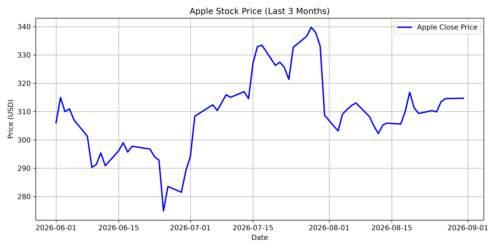

# 📈 Automated End-to-End Stock Data Pipeline & Visualization (Individual Project)

A robust data engineering and analytics pipeline built with Python that fetches live stock data from Yahoo Finance, stores it securely in a local SQLite database, automates daily ingestion, and provides clear visual insights.

---

## 🚀 Key Features
* **Automated Daily Scheduling:** Uses the `schedule` library to automatically trigger data updates every day at 9:00 AM.
* **Data Engineering & Storage:** Cleans and processes raw API data, structuring it relationally within an **SQLite** database (`Stock_Project.db`).
* **Data Visualization:** Generates professional trend charts using **Matplotlib** and **Pandas** to track asset performance over time.
* **Robust Error Handling:** Built-in `try-except` exception handling to manage network disruptions and API limits gracefully without crashing the background system.

---

## 🛠️ Tech Stack
* **Language:** Python
* **Libraries:** `yfinance`, `pandas`, `sqlite3`, `matplotlib`, `schedule`, `time`
* **Database:** SQLite
* **Environment:** VS Code

---

## ⚙️ How It Works
1. **`app.py` (Local Automation):** Run this on your own machine to keep it continuously running — checks the schedule, and at 9:00 AM daily fetches fresh Apple (AAPL) stock data from Yahoo Finance while handling errors safely and updating the SQLite database.
2. **`visualize.py` (Analytics & Export):** Queries the local SQLite database, processes the time-series data, plots a clean 3-month closing price trend line, and automatically saves the output as `apple_stock_graph.png`.

## ☁️ Cloud Automation (GitHub Actions)

Instead of keeping a laptop running 24/7 for `app.py`'s scheduler, this repo also includes a **GitHub Actions workflow** (`.github/workflows/daily_update.yml`) that runs entirely in the cloud:

- Every day at 09:00 UTC, GitHub automatically spins up a runner, executes `cloud_update.py` (a one-shot version of the fetch + chart pipeline suited for CI), and **commits the refreshed `Stock_Project.db` and `apple_stock_graph.png` straight back to this repo.**
- No server, no laptop required — it's completely free on GitHub's public-repo Actions minutes.
- You can also trigger it manually anytime from the repo's **Actions** tab → **Daily Stock Data Update** → **Run workflow**.

---

## 📊 Sample Output
Here is a snapshot of the generated stock trend chart:

*(This chart is automatically regenerated and saved as `apple_stock_graph.png` every time `visualize.py` runs.)*

---
*Built with passion as part of a data analytics & engineering journey.*